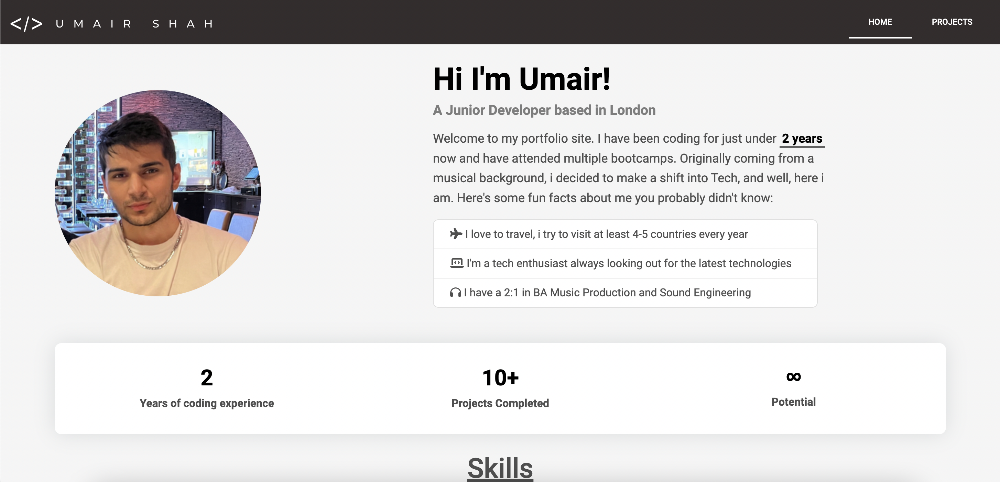

# React Portfolio

## Description
I created this repository to hold my submission for the final challenge which was to create a portfolio using React, whilst and also encorparting everything that we've learnt over the duration of the bootcamp.

This task helped me really grasp how to components, props and how to dybnamically render things depending on certain variables being true or false

Below is a screenshot of what the project should look like when opened in the browser 

## Usage

To use and try out this project, first clone the repository from GitHub with the following link: https://github.com/umairshah14/React-Portfolio.git and then running npm i and npm start

OR

visit the live deployed website at: https://charming-pothos-6f390b.netlify.app/

## Credits

Umair Shah

## Resources

- https://react-bootstrap.github.io/components/navs/#nav-link-props
- https://legacy.reactjs.org/docs/components-and-props.html